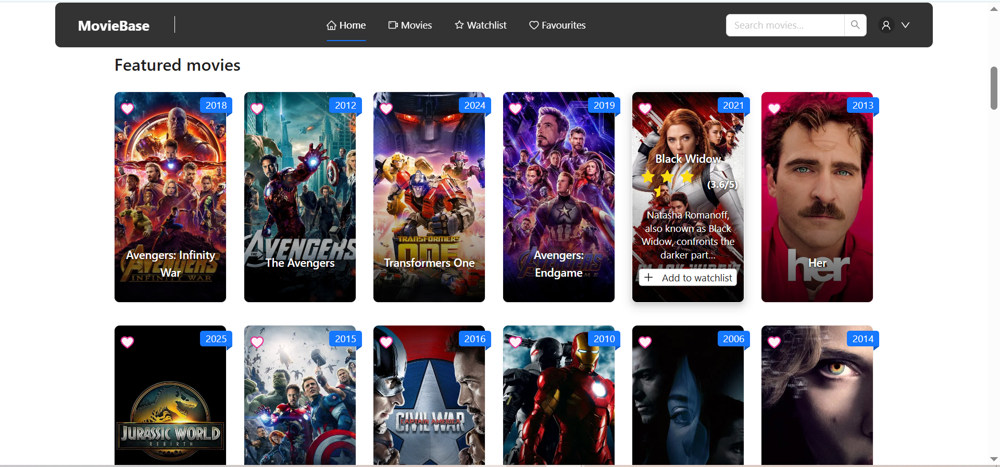

# MovieBase

A modern movie discovery web app built with **React**, **Ant Design**, and **Firebase**.  
Search, browse, and favorite movies and actors, with rich media, user reviews, and real-time user lists.  
Responsive, mobile-ready, and built on [The Movie Database (TMDB)](https://www.themoviedb.org/) API.

---

## Features

### Authentication

- Email/password sign-up and login via **Firebase Authentication**
- Persistent user session management
- Auth-required features (favorites, watchlist, etc.)

### Movie & TV Browsing

- Trending and popular movies, with poster art, ratings, and info
- Dedicated **Movie Detail** screen:
  - High-res poster & trailer
  - Overview, tagline, genres, production info, release data
  - **Cast** carousel
  - User reviews
  - Related images and backgrounds

### Actor/Person Profiles

- Actor/Person detail screens with biography, photo, and birth info
- List of all movies and TV shows they have appeared in
- Add/remove favorite actors

### User Lists & Firestore Sync

- Favorite movies and actors (star/heart toggles)
- Add/remove movies from **watchlist**
- All user favorites and lists stored in **Firebase Firestore**
- Real-time updates; lists persist across devices/sessions

### Account Management

- Profile menu with avatar
- Logout from all devices

### Responsive UI & UX

- Adaptive NavBar with tabs and drawer for mobile
- Affixed, transparent, and blurred header for a modern feel
- Fast, accessible UI with loading skeletons and feedback

### Built With

- **React** (Vite)
- **Ant Design** (UI Components)
- **Firebase** (Authentication + Firestore)
- **Redux Toolkit** (user state/lists)
- **TMDB API** (data, images, videos)

---

## Project Structure

- `/src/components/` – Reusable UI: MovieItem, ActorItem, Carousels, Grids
- `/src/pages/` – Screens: Home, Movies, Actor, Movie Detail, Search, Login
- `/src/store/` – Redux slices for user lists and authentication
- `/src/api/` – TMDB and Firestore API helpers

---

## Setup & Development

1. **Clone the repo**  
   `git clone https://github.com/youruser/moviebase.git`

2. **Install dependencies**  
   `npm install`

3. **Firebase setup**  
   - Add your Firebase project config to `.env` as `VITE_FIREBASE_API_KEY` etc.
   - Set up Firestore and enable Authentication (email/password + Google).

4. **TMDB API setup**  
   - Get a free TMDB API key at [TMDB API](https://developers.themoviedb.org/3)
   - Add to `.env` as `VITE_TMDB_API_KEY`

5. **Start the app**  
   `npm run dev`

---

## Usage

- **Browse movies:** See trending, search by title, actor, or TV show.
- **Login:** Click the user icon to sign up/in (email or Google).
- **Favorite or watch:** Add movies/actors to your lists.
- **Your lists:** Accessible under Watchlist and Favourites tabs.
- **See actor or movie details:** Click any poster or name.

---

## Screenshots

  
Show images

  
  
  
  
  
  
  

---

## License

This project is for educational/demo purposes.  
TMDB API and images © TMDB.

---

**Made by Davit Mutafyan. Open for contributions**

